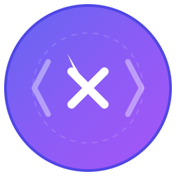

# LocateX

**Click on UI Component in the browser to open its code in your IDE.**

## What is LocateX?

LocateX is a developer tool that bridges the gap between your browser and your code editor. With a simple click, you can navigate from any UI component directly to its source code, making debugging and development faster and more intuitive.

## Key Features

- 🎯 **One-click code navigation** - Click any component to jump to its source
- ⚡ **Multi-framework support** - Works with React, Vue, Svelte, SolidJS, Preact
- 🔍 **Smart component detection** - Automatically finds components in dev mode
- 🛠️ **Editor integration** - Seamless integration with VS Code, WebStorm, and more
- 🎨 **Visual component highlighting** - See component boundaries as you hover

## Install Browser Extension

### Chrome / Brave / Opera / Edge
[Install from Chrome Web Store](https://chrome.google.com/webstore/detail/locatorjs/npbfdllefekhdplbkdigpncggmojpefi)

### Firefox
[Install from Firefox Add-ons](https://addons.mozilla.org/cs/firefox/addon/locatorjs/)

### Manual Installation
See [Extension README](./apps/extension/README.md) for building and installing locally.

## Install as a Library

You can also use LocateX as a library in your project. See [installation docs](https://www.locatorjs.com/install) for details.

### Framework-specific guides:
- [React DevTools based](https://www.locatorjs.com/install/react)
- [React data-id based](https://www.locatorjs.com/install/react-data-id)
- [SolidJS](https://www.locatorjs.com/install/solidjs)
- [Preact](https://www.locatorjs.com/install/preact)
- [Svelte](https://www.locatorjs.com/install/svelte)
- [Vue](https://www.locatorjs.com/install/vue)

> [!NOTE]
> For Next.js 15+ with Turbopack or SWC, use the [@locator/webpack-loader](https://www.locatorjs.com/install/react) instead of the direct babel plugin.

## Quick Start

1. **Install the browser extension** (see above)
2. **Open your app in development mode**
3. **Hold Alt (Option on Mac) and click any component**
4. **Your editor opens with the component's source code!**

## How It Works

LocateX uses source maps and component metadata to create a bridge between your running application and your source code. When you click a component:

1. LocateX identifies the component and its location
2. Extracts source file path and line number
3. Opens your editor using URL scheme handlers (e.g., `vscode://`, `webstorm://`)
4. Navigates directly to the component definition

## Contributing

We welcome contributions! Feel free to:
- Report bugs
- Suggest features
- Submit pull requests

[See contributing guide](./contributing.md) for more information.

## Similar Projects

- [click-to-component](https://github.com/ericclemmons/click-to-component)
- [react-dev-inspector](https://github.com/zthxxx/react-dev-inspector)
- [vite-plugin-react-inspector](https://github.com/sudongyuer/vite-plugin-react-inspector)
- [vite-plugin-svelte](https://github.com/sveltejs/vite-plugin-svelte/tree/main/packages/vite-plugin-svelte/src/ui/inspector)
- [vite-plugin-vue-inspector](https://github.com/webfansplz/vite-plugin-vue-inspector)
- [solid-devtools/locator](https://github.com/thetarnav/solid-devtools/tree/main/packages/locator)
- [code-inspector-plugin](https://github.com/zh-lx/code-inspector)

## License

MIT

---

Made with ❤️ for developers who want to code faster
